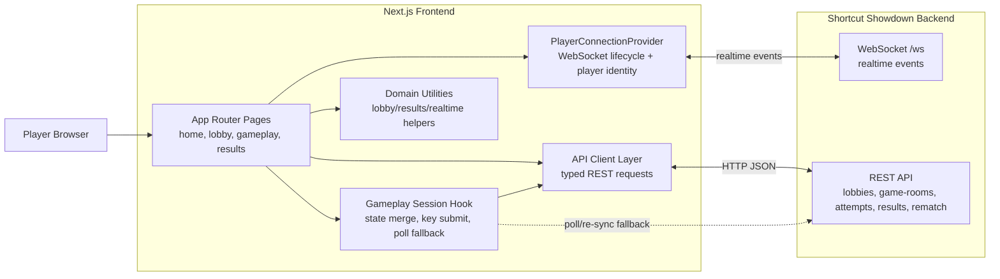

# Shortcut Showdown Frontend

Frontend client for **Shortcut Showdown**, built with **Next.js App Router**, **React 19**, **TypeScript**, and **Tailwind CSS**. It powers the full player flow: home → lobby → gameplay → results (with rematch handling).

## High-level architecture



## Requirements

- Node.js (LTS)
- [pnpm](https://pnpm.io) (project uses `pnpm@10.33.0`)

## Setup

```bash
pnpm install
pnpm dev
```

App runs at [http://localhost:3000](http://localhost:3000).

## Environment variables

Create `.env.local` (or set env vars in your runtime):

| Variable | Purpose | Default |
| --- | --- | --- |
| `NEXT_PUBLIC_API_BASE_URL` | Base URL for REST requests | `http://localhost:8000` |
| `NEXT_PUBLIC_WS_URL` | Optional explicit WebSocket base URL | derived from API URL |
| `NEXT_PUBLIC_WS_PATH` | WebSocket path | `/ws` |
| `NEXT_PUBLIC_APP_VERSION` | Version label shown in UI | `v 1.0.0` |

## Available scripts

| Command | Description |
| --- | --- |
| `pnpm dev` | Start development server |
| `pnpm build` | Build production bundle |
| `pnpm start` | Run production server |
| `pnpm lint` | Run ESLint |
| `pnpm test` | Run Vitest test suite |
| `pnpm test:watch` | Run tests in watch mode |

## Frontend route flow

- `/` — create, join, or quick-play a lobby
- `/lobby?id=...` — roster, settings, readiness, start flow
- `/gameplay?room=...` — realtime race UI with REST fallback polling
- `/results?room=...&player=...` — leaderboard, telemetry, rematch decisions

## Project structure

- `app/` — App Router pages, layouts, and screen-level client components
- `lib/api/` — typed REST client and endpoint wrappers
- `lib/realtime/` — WebSocket connection context and message helpers
- `lib/gameplay/`, `lib/lobby/`, `lib/results/` — feature-domain logic/hooks/utilities
- `lib/session/` — session-scoped persistence helpers (for results context)
- `public/` — static assets

---

## 👥 Team

<div align="center">

<table>
<tr>
<td align="center" width="50%" valign="top">
  <br />
  <strong>Hans Matthew Del Mundo</strong><br />
  <a href="https://github.com/hdmGOAT"><kbd>@hdmGOAT</kbd></a>
</td>
<td align="center" width="50%" valign="top">
  <br />
  <strong>Gerald Helbiro Jr.</strong><br />
  <a href="https://github.com/potakaaa"><kbd>@potakaaa</kbd></a>
</td>
</tr>
<tr>
<td align="center" width="50%" valign="top">
  <br />
  <strong>Vin Marcus Gerebise</strong><br />
  <a href="https://github.com/areeesss"><kbd>@areeesss</kbd></a>
</td>
<td align="center" width="50%" valign="top">
  <br />
  <strong>Ira Chloie Narisma</strong><br />
  <a href="https://github.com/unripelo"><kbd>@unripelo</kbd></a>
</td>
</tr>
</table>

</div>
