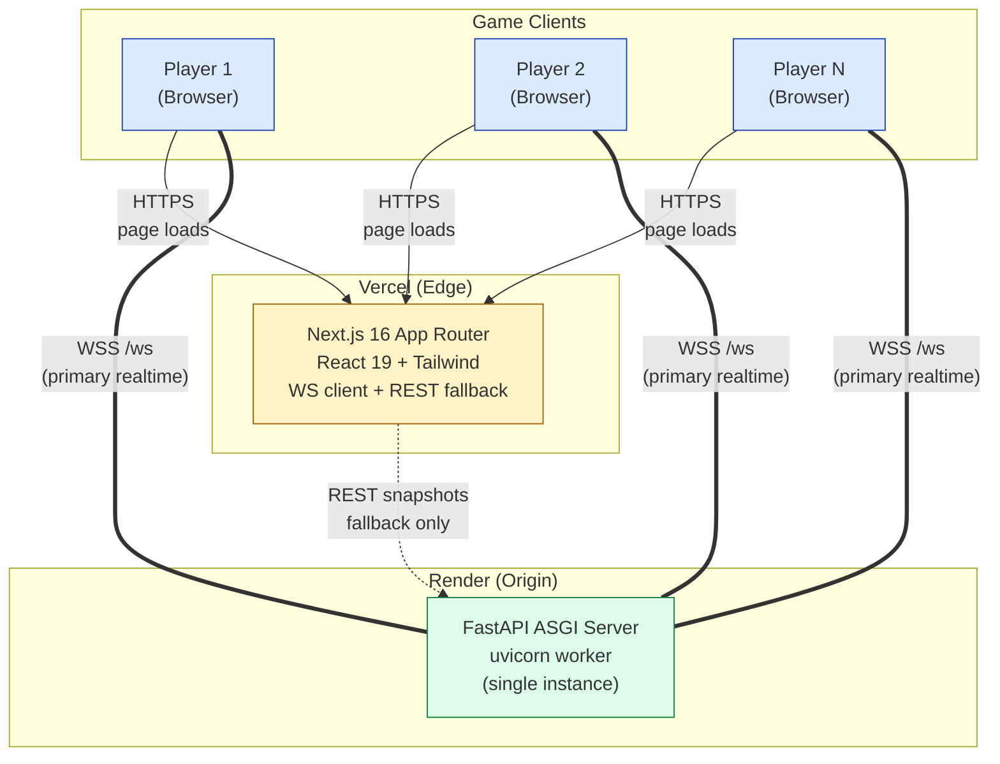

# Shortcut Showdown API



Backend and HTTP surface for **Shortcut Showdown**, implemented with the [Next.js](https://nextjs.org) App Router. The stack uses **TypeScript**, **React 19**, and **Tailwind CSS** for any app-facing routes and tooling.

## Requirements

- Node.js (LTS recommended)
- [pnpm](https://pnpm.io) (see `package.json` → `packageManager` for the version Corepack should use)

## Setup

Install dependencies:

```bash
pnpm install
```

## Scripts

| Command       | Description              |
| ------------- | ------------------------ |
| `pnpm dev` | Start the dev server     |
| `pnpm build` | Production build       |
| `pnpm start`   | Run the production server |
| `pnpm lint` | Run ESLint              |

Local development defaults to [http://localhost:3000](http://localhost:3000).

## Project layout

- `app/` — App Router entry (`layout.tsx`, `page.tsx`, and future API routes under `app/api/` as you add them)

---

## 👥 Team

<div align="center">

<table>
<tr>
<td align="center" width="50%" valign="top">
  <br />
  <strong>Hans Matthew Del Mundo</strong><br />
  <a href="https://github.com/hdmGOAT"><kbd>@hdmGOAT</kbd></a>
</td>
<td align="center" width="50%" valign="top">
  <br />
  <strong>Gerald Helbiro Jr.</strong><br />
  <a href="https://github.com/potakaaa"><kbd>@potakaaa</kbd></a>
</td>
</tr>
<tr>
<td align="center" width="50%" valign="top">
  <br />
  <strong>Vin Marcus Gerebise</strong><br />
  <a href="https://github.com/areeesss"><kbd>@areeesss</kbd></a>
</td>
<td align="center" width="50%" valign="top">
  <br />
  <strong>Ira Chloie Narisma</strong><br />
  <a href="https://github.com/unripelo"><kbd>@unripelo</kbd></a>
</td>
</tr>
</table>

</div>
